  <h1>Hi there, I'm ctag! 👋</h1>
  <h3>A developer passionate about the intersection of Mathematics and Machine Learning.</h3>
  

    
  

---

### 🚀 About Me
- 🎓 I'm a freshman majoring in **Computational Mathematics**.
- 🔭 I’m currently focused on developing my skills in **web tooling**, **machine learning**, and **graphics programming**.
- 💬 Feel free to ask me about **C#**, **Go**, **Python**, or anything else you see here!

---

<h2 align="center">My Tech Stack</h2>

  
  <h4>Languages</h4>
  

    
  

  
  <h4>Frameworks & Libraries</h4>
  

    
  

  
  <h4>Tools & Platforms</h4>
  

    
  

  <h4>Development Environment</h4>
  

    
  

  

---

<h2 align="center">GitHub Stats & Activity</h2>

<table>
  <tr>
    <td valign="top" width="50%">
      
    </td>
    <td valign="top" width="50%">
      
    </td>
  </tr>
</table>

