  

  
  ### Computational Mathematics Student • Machine Learning Enthusiast • Developer
  
  

    
    
  

  

---

## About

Computational Mathematics student and developer with an interest in machine learning, game theory, and graphics programming. I build tools or models that solve interesting problems.

**Areas of interest:**
- Machine learning and AI agent development
- Game AI and reinforcement learning
- Low level coding and optimization
- Mathematical modeling and computational methods

---

## Proficiencies

**Languages**  

**Machine Learning & AI**  

**Game Development**  

**Tools & Platforms**  

---

## GitHub Activity

  
  

---

  
**Contact**

For collaborations or inquiries, visit [my website](https://geisinger.dev) or reach out via email.
  

